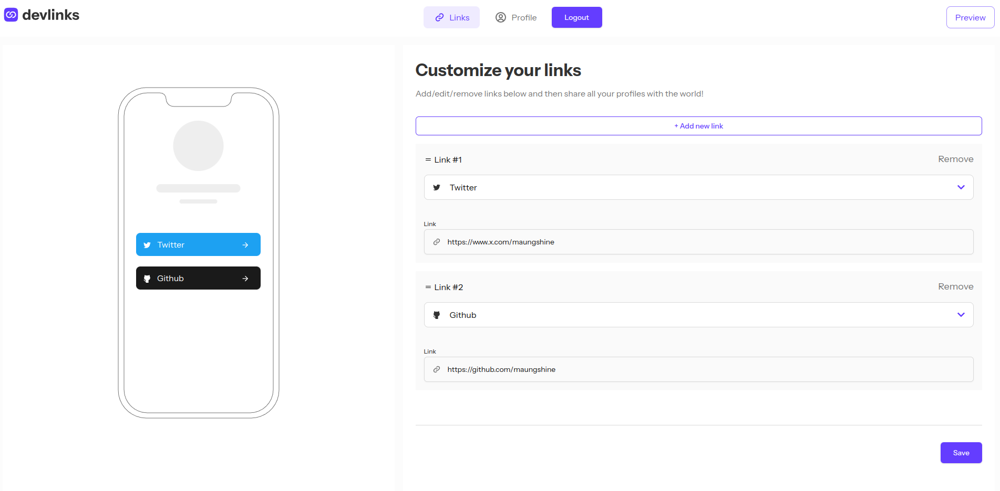
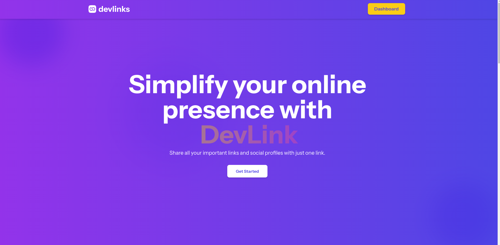

# Frontend Mentor - Link-sharing app solution

This is a solution to the [Link-sharing app challenge on Frontend Mentor](https://www.frontendmentor.io/challenges/linksharing-app-Fbt7yweGsT). Frontend Mentor challenges help you improve your coding skills by building realistic projects.

## Table of contents

- [Frontend Mentor - Link-sharing app solution](#frontend-mentor---link-sharing-app-solution)
  - [Table of contents](#table-of-contents)
  - [Overview](#overview)
    - [The challenge](#the-challenge)
    - [Screenshot](#screenshot)
    - [Links](#links)
  - [My process](#my-process)
    - [Built with](#built-with)
    - [What I learned](#what-i-learned)
    - [Continued development](#continued-development)
    - [Useful resources](#useful-resources)
  - [Author](#author)
  - [Getting Started](#getting-started)
  - [Learn More](#learn-more)
  - [Deploy on Vercel](#deploy-on-vercel)

**Note: Delete this note and update the table of contents based on what sections you keep.**

## Overview

### The challenge

Users should be able to:

- Create, read, update, delete links and see previews in the mobile mockup
- Receive validations if the links form is submitted without a URL or with the wrong URL pattern for the platform
- Drag and drop links to reorder them
- Add profile details like profile picture, first name, last name, and email
- Receive validations if the profile details form is saved with no first or last name
- Preview their devlinks profile and copy the link to their clipboard
- View the optimal layout for the interface depending on their device's screen size
- See hover and focus states for all interactive elements on the page
- **Bonus**: Save details to a database (build the project as a full-stack app)
- **Bonus**: Create an account and log in (add user authentication to the full-stack app)

### Screenshot



**I created my own landing page**



### Links

- Solution URL: [Add solution URL here](https://github.com/maungshine/link-sharing-app)
- Live Site URL: [Add live site URL here](https://link-sharing-app-sigma-mauve.vercel.app/)

## My process

### Built with

- Semantic HTML5 markup
- Tailwind CSS
- Shadcn ui
- Responsive layout with Flexbox and CSS Grid
- Mobile-first workflow
- [React](https://reactjs.org/) - JS library
- [Next.js](https://nextjs.org/) - React framework
- [zod](https://zod.dev) - For form validation
- [Framer Motion](https://framer.com/) - For animation
- [Prisma](https://prisma.io) - For ORM
- [Neon Postgres](https://neon.tech) - For Database
- [AWS S3](https://aws.amazon.com) - For Image Storage

### What I learned

I learned lots of new things by completing this chanllenge from [Frontend Mentor](https://frontendmentor.io).
One of it is creating drag and drop features with dnd kit. I have to handle all the states of the links when a user reorder the list using dnd in two parts. One is in mockup component which need to be synced with the left side of the links which is controlled by the user. I satisfied tackling this challenge.

Another challenge is that links are dynamic forms and I needed to validate dynamically and return errors to the specific link that those errors belongs to.

Next moment that satisfying me is creating my own landing page. It includes some cool animations.

### Continued development

The areas I need to improve is creating animations with framer motion. I will continuously improve my skill on creating animation.

### Useful resources

- [Medium](https://www.medium.com) - This website has many useful articles when I stuck in something and finding ways how other people solve that problem.

## Author

- Website - [Maung Shine](https://www.maungshine.site)
- Frontend Mentor - [@maungshine](https://www.frontendmentor.io/profile/maungshine)
- Twitter - [@devmaungshine](https://www.x.com/devmaungshine)

This is a [Next.js](https://nextjs.org/) project bootstrapped with [`create-next-app`](https://github.com/vercel/next.js/tree/canary/packages/create-next-app).

## Getting Started

First, run the development server:

```bash
npm run dev
# or
yarn dev
# or
pnpm dev
# or
bun dev
```

Open [http://localhost:3000](http://localhost:3000) with your browser to see the result.

You can start editing the page by modifying `app/page.tsx`. The page auto-updates as you edit the file.

This project uses [`next/font`](https://nextjs.org/docs/basic-features/font-optimization) to automatically optimize and load Inter, a custom Google Font.

## Learn More

To learn more about Next.js, take a look at the following resources:

- [Next.js Documentation](https://nextjs.org/docs) - learn about Next.js features and API.
- [Learn Next.js](https://nextjs.org/learn) - an interactive Next.js tutorial.

You can check out [the Next.js GitHub repository](https://github.com/vercel/next.js/) - your feedback and contributions are welcome!

## Deploy on Vercel

The easiest way to deploy your Next.js app is to use the [Vercel Platform](https://vercel.com/new?utm_medium=default-template&filter=next.js&utm_source=create-next-app&utm_campaign=create-next-app-readme) from the creators of Next.js.

Check out our [Next.js deployment documentation](https://nextjs.org/docs/deployment) for more details.
